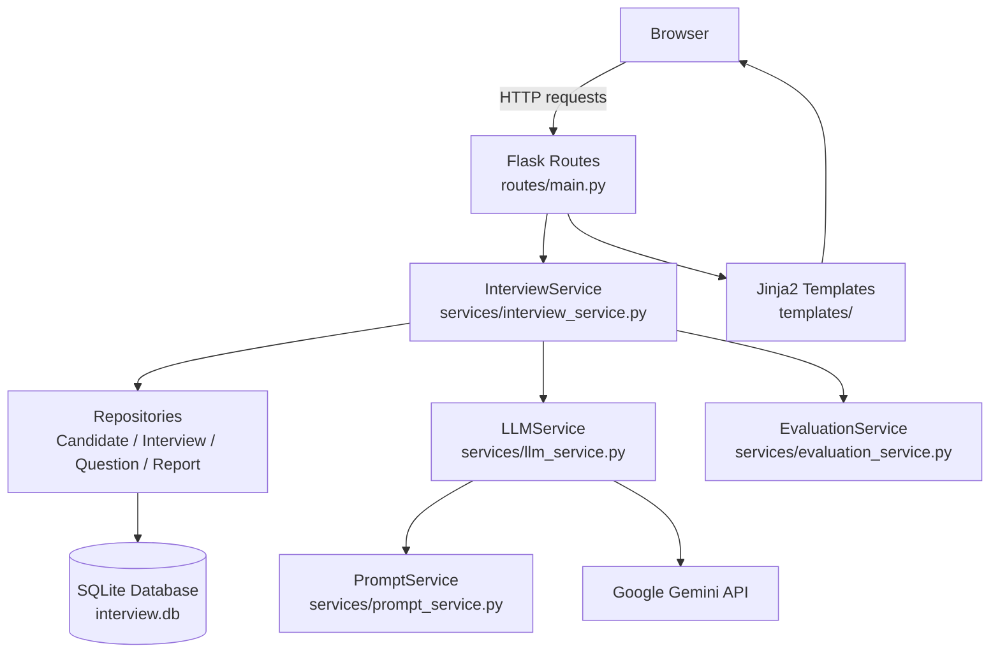

# InterviewGenAI

## Project Overview

InterviewGenAI is a Flask-based web application that simulates a live, AI-driven technical interview. A candidate fills out a short setup form (role, experience level, interview type, and difficulty), and the app uses Google's Gemini API to generate interview questions one at a time, adapting each follow-up question to the candidate's previous answers. Every answer is evaluated by Gemini and scored across technical, communication, and confidence dimensions, with results persisted to a local SQLite database and displayed on a per-question report page.

The project follows a layered architecture (routes → services → repositories → models) intended to keep the Flask routes thin and push business logic and AI orchestration into dedicated service classes.

> **Note:** This project is under active development. Several modules (resume-based interviews, text-to-speech, Whisper-based speech input, PDF report export, and some front-end assets) exist as scaffolding/placeholders in the codebase but are not yet functional.

## Features

- **Guided interview setup** — candidates provide their name, optional email, target role, experience level, interview type (Technical / HR / Behavioral / Mixed), and difficulty (Easy / Medium / Hard).
- **AI-generated interview questions** — the first question and every follow-up question are generated dynamically by Google Gemini based on the candidate's profile and prior answers.
- **Adaptive questioning** — each follow-up question is generated using the full question/answer history, allowing difficulty to increase or decrease based on performance.
- **AI answer evaluation** — every submitted answer is scored by Gemini on technical accuracy, communication, and confidence, with an overall score and written feedback plus an "ideal answer".
- **Live interview UI** — a browser-based interview screen with a timer, progress bar, and real-time score/feedback updates (`static/js/interview.js`).
- **Per-question report page** — displays each question, the candidate's answer, and its technical/communication/confidence/overall scores.
- **Persistent storage** — candidates, interviews, and interview questions are persisted to a local SQLite database via SQLAlchemy models.
- **Layered backend design** — dedicated DTOs, enums, repositories, and services separate persistence, AI orchestration, and web routing concerns.

## Tech Stack

| Layer | Technology |
|---|---|
| Backend framework | Flask 3 |
| ORM / Database | Flask-SQLAlchemy, Flask-Migrate, SQLite |
| AI / LLM | Google Gemini (`google-genai`) |
| Templating | Jinja2 |
| Frontend styling | Tailwind CSS (CDN), Google Fonts (Inter) |
| Frontend scripting | Vanilla JavaScript |
| Configuration | python-dotenv |
| Other dependencies | Flask-SocketIO, eventlet, openai, openai-whisper, torch, torchaudio, edge-tts, pdfplumber, PyPDF2, pydub, pandas, numpy (present in `requirements.txt` for planned features; not yet wired into the app) |

## Project Architecture



## Folder Structure

```
InterviewGenAI/
├── app.py                     # Flask app factory: config, DB init, blueprint registration
├── config.py                  # Loads .env values, defines DB URI and Gemini model config
├── check_models.py            # Utility script to list available Gemini models
├── requirements.txt           # Python dependencies
├── interview.db               # SQLite database file
│
├── database/
│   ├── db.py                  # SQLAlchemy instance
│   ├── models.py              # Aggregates model imports
│   └── structure.md           # Notes on the database schema
│
├── models/                    # SQLAlchemy ORM models + runtime session object
│   ├── candidate.py
│   ├── interview.py
│   ├── interview_question.py
│   ├── interview_report.py
│   ├── interview_session.py   # In-memory (non-persisted) interview session helper
│   └── conversation_message.py
│
├── dto/
│   └── interview_request.py   # Data Transfer Object for starting a new interview
│
├── enums/
│   ├── interview_status.py    # Interview status values (Pending, In Progress, etc.)
│   └── question_type.py       # Question category values (Technical, HR, Coding, etc.)
│
├── repositories/               # Data-access layer around SQLAlchemy models
│   ├── candidate_repository.py
│   ├── interview_repository.py
│   ├── interview_question_repository.py
│   └── interview_report_repository.py
│
├── services/
│   ├── interview_service.py   # Orchestrates the interview lifecycle
│   ├── llm_service.py         # Talks to the Gemini API
│   ├── prompt_service.py      # Builds all prompts sent to Gemini
│   ├── evaluation_service.py  # Validates/normalizes Gemini's evaluation JSON
│   └── session_manager.py     # In-memory session registry
│
├── prompts/                   # Prompt reference/notes for each interview stage
│
├── routes/
│   ├── main.py                 # Home, setup, interview, submit-answer, and report routes
│   └── api.py                   # Additional answer-submission endpoint (not yet registered)
│
├── templates/                  # Jinja2 HTML templates (base, index, setup, interview, report)
│
└── static/
    ├── css/                     # Stylesheets (Tailwind is loaded via CDN)
    └── js/                      # Client-side scripts (interview.js drives the live interview UI)
```

## Installation & Setup

**Prerequisites:** Python 3.10+ and a Google Gemini API key.

```bash
# 1. Clone the repository
git clone https://github.com/javeshK/InterviewGenAI.git
cd InterviewGenAI

# 2. Create and activate a virtual environment
python -m venv .venv
source .venv/bin/activate   # On Windows: .venv\Scripts\activate

# 3. Install dependencies
pip install -r requirements.txt

# 4. Configure environment variables
cp .env.example .env   # or create a .env file manually (see Configuration below)

# 5. Run the application
python app.py
```

The app runs in debug mode by default and creates the SQLite database tables automatically on startup.

## Usage

1. Start the server with `python app.py`.
2. Open `http://127.0.0.1:5000/` in your browser.
3. Click through to `/setup` and fill in your name, target role, experience, interview type, and difficulty.
4. Submitting the form starts a new interview and generates the first AI question via Gemini.
5. Answer each question on the `/interview/<interview_id>` screen; answers are submitted to `/submit-answer`, evaluated by Gemini, and followed by the next adaptive question.
6. Once all questions are completed, you are redirected to `/report/<interview_id>`, which lists every question with its technical, communication, confidence, and overall scores.

## Configuration

The app loads configuration from a `.env` file at the project root (via `python-dotenv`).

| Variable | Required | Description |
|---|---|---|
| `GEMINI_API_KEY` | Yes | API key used by `LLMService` to call the Google Gemini API. |
| `SECRET_KEY` | No | Flask secret key. Defaults to `interviewgenai_secret_key` if not set. |

The SQLite database path and the Gemini model (`gemini-3.1-flash-lite`) are currently hard-coded in `config.py`.

## Future Improvements

Based on scaffolding already present in the repository, the following are logical next steps for the project:

- Wire up the empty front-end modules (`charts.js`, `export.js`, `particles.js`, `speech.js`, `setup.js`) and their corresponding stylesheets.
- Implement the placeholder services (`report_service.py`, `resume_service.py`, `tts_service.py`, `whisper_service.py`) to support resume-based interviews, text-to-speech question playback, and speech-to-text answers.
- Register and complete the `routes/api.py` blueprint and the empty `routes/interview.py` / `routes/report.py` route files.
- Generate and persist a full `InterviewReport` (strengths, weaknesses, recommendations, final summary) using the existing `build_final_report_prompt`.
- Add automated tests (current `test_database.py` and `test_llm.py` scripts are outdated manual scratch scripts).

## Contributing

Contributions are welcome. If you'd like to contribute:

1. Fork the repository.
2. Create a feature branch (`git checkout -b feature/your-feature`).
3. Commit your changes with clear messages.
4. Open a pull request describing your changes.

Please open an issue first for larger changes to discuss scope and design.

## License

No license file is currently included in this repository. All rights are reserved by the author unless a license is added.

## Author

**Javesh Khosla** ([@javeshK](https://github.com/javeshK))  
